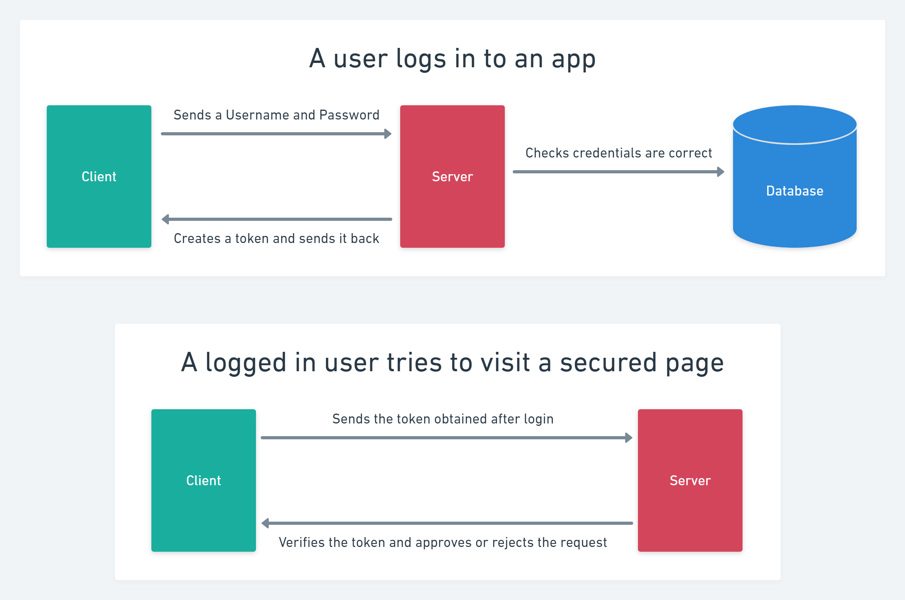

# C# API Jwt Bearer Token Authentication

## Introduction

Example of an .Net 8 WebApi project with a simple bearer token authentication system. Here's a reminder for the flow:

1. The client sends a request containing login credentials to the server.
2. The server checks the credentials are correct and sends back a token.
3. The client sends a request to a secure resource, putting the token in the `authorization` header of the request.
4. The server verifies that the token is valid and sends back the requested resource, or an error message if the token wasn't valid.

Here's the diagram again to help you visualise this flow:



https://jwt.io/

```json

{
  "SiteSettings": {
    "AdminEmail": "example@test.com",
    "AdminPassword": "administrator"
  },

  "JwtTokenSettings": {
    "ValidIssuer": "ExampleIssuer",
    "ValidAudience": "ExampleAudience",
    "SymmetricSecurityKey": "v89h3bh89vh9ve8hc89nv98nn899cnccn998ev80vi809jberh89b",
    "JwtRegisteredClaimNamesSub": "rbveer3h535nn3n35nyny5umbbt"
  },

  "Logging": {
    "LogLevel": {
      "Default": "Information",
      "Microsoft.AspNetCore": "Warning"
    }
  },
  "AllowedHosts": "*",

  "ConnectionStrings": {
    "DefaultConnectionString": "Host=HOST; Database=DATBASE; Username=USERNAME; Password=PASSWORD; "
  }
}

```

The following dependencies have been installed:

```
Install-Package Microsoft.AspNetCore.Authentication.JwtBearer
Install-Package Microsoft.AspNetCore.Identity.entityFrameworkCore
Install-Package Microsoft.AspNetCore.OpenApi
Install-Package Microsoft.EntityFrameworkCore
Install-Package Microsoft.EntityFrameworkCore.Design
Install-Package Microsoft.EntityFrameworkCore.Tools
Install-Package Npgsql.EntityFrameworkCore.PostgreSQL
```

## Further Reading:

-https://learn.microsoft.com/en-us/aspnet/core/security/authentication/customize-identity-model?view=aspnetcore-8.0
-https://jwt.io/
